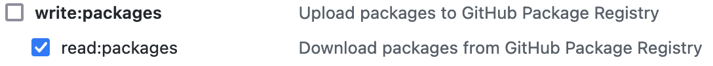

# Authenticating to GitHub packages

This Maven package is distributed through the GitHub [package registry](https://docs.github.com/en/packages/working-with-a-github-packages-registry).
In order to install this package you'll need a GitHub [access token](https://github.com/settings/tokens/new) with the following scope: `read:packages` as described in the [GitHub documentation](https://docs.github.com/en/packages/learn-github-packages/about-permissions-for-github-packages#about-scopes-and-permissions-for-package-registries)

